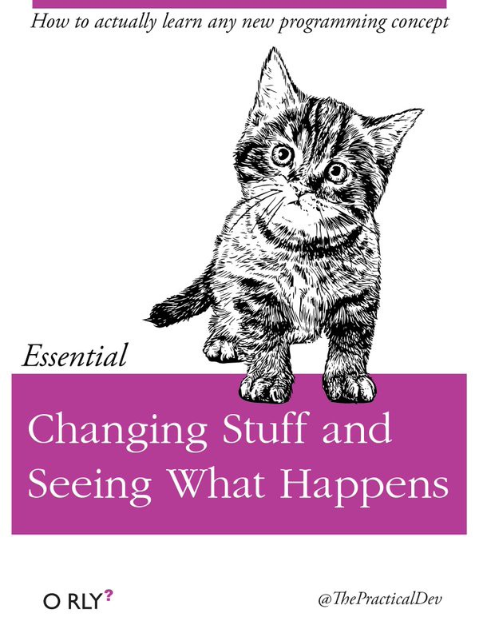

<p class="r-stretch"></p>

## reveal.js <!-- .element: class="fragment fade-up"-->

---

## reveal.js

This is the Fiberplane slides template for working with `reveal.js` - a powerful framework for HTML-based slides.

---

# Why HTML slides?

Markdown-based (i.e.: adding code is not a pain) <!--.element: class="fragment" -->

Source control and versioning (<3 git) <!--.element: class="fragment" -->

URL publishing (with static site builders like Netlify or Vercel) <!--.element: class="fragment" -->

---

You can add your slide content as markdown to the `fiberplane.md` file using `---` as slide separators.

---

## Headings

_☝️ lvl 2_ <!-- .element: class="fragment" data-fragment-index="2" -->

There are four levels of headings defined in the template.

### I'm lvl 3 <!-- .element: class="fragment" data-fragment-index="0" -->

#### I'm lvl 4 <!-- .element: class="fragment" data-fragment-index="1" -->

---

<!-- .slide: class="r-left" -->

## Images

you can add images to the slides using markdown

```md

```

or if the image is too large for the screen - use the following HTML snippet

```html
<p class="r-stretch"></p>
```

Not pretty but it works.

---

<p class="r-stretch"></p>

---


---

<!-- .slide: data-auto-animate data-auto-animate-id="code" -->

## Code

You can add code cells with three backticks and specify syntax highlighting:

<code>```jsonnet</code>

```jsonnet[]
function(
    event={}
)
  fp.notebook
    .new('Incident Response - ' + event.id)
    .addCells([
      c.text('Environment: ' + event.environment),
      c.text('On-call:'),
      std.map(
        function(assignees)
            c.listItem.unordered(assignees.name),
            event.assignees
        )
    ])
```

---

<!-- .slide: data-auto-animate data-auto-animate-id="code" -->

Code can be further highlighted and animated by specifying line numbers in square brackets like this:

<code>```jsonnet[|1-3|4-5|6-14]]</code>

```jsonnet[|1-3|4-5|6-14]]
function(
    event={}
)
  fp.notebook
    .new('Incident Response - ' + event.id)
    .addCells([
      c.text('Environment: ' + event.environment),
      c.text('On-call:'),
      std.map(
        function(assignees)
            c.listItem.unordered(assignees.name),
            event.assignees
        )
    ])
```

---

Including very long lines of code such as this:

```rust[|1-10|35-46|59-66]
use crate::primitives::Primitive;
use quote::{quote, ToTokens};
use std::{collections::BTreeMap, hash::Hash};
use syn::Item;

mod cargo_dependency;
mod custom_type;
mod enums;
mod structs;
mod type_ident;

pub use cargo_dependency::CargoDependency;
pub use custom_type::CustomType;
pub use enums::{Enum, EnumOptions, Variant, VariantAttrs};
pub use structs::{Field, FieldAttrs, Struct, StructOptions};
pub use type_ident::TypeIdent;

pub type TypeMap = BTreeMap<TypeIdent, Type>;

#[derive(Clone, Debug, Eq, Hash, PartialEq)]
pub enum Type {
    Alias(String, TypeIdent),
    Container(String, TypeIdent),
    Custom(CustomType),
    Enum(Enum),
    List(String, TypeIdent),
    Map(String, TypeIdent, TypeIdent),
    Primitive(Primitive),
    String,
    Struct(Struct),
    Tuple(Vec<TypeIdent>),
    Unit,
}

impl Type {
    pub fn from_item(item_str: &str) -> Self {
        let item = syn::parse_str::<Item>(item_str).unwrap();
        match item {
            Item::Enum(item) => Type::Enum(enums::parse_enum_item(item)),
            Item::Struct(item) => Type::Struct(structs::parse_struct_item(item)),
            item => panic!(
                "Only struct and enum types can be constructed from an item. Found: {:?}",
                item
            ),
        }
    }

    pub fn name(&self) -> String {
        match self {
            Self::Alias(name, _) => name.clone(),
            Self::Container(name, ident) => format!("{}<{}>", name, ident),
            Self::Custom(custom) => custom.ident.to_string(),
            Self::Enum(Enum { ident, .. }) => ident.to_string(),
            Self::List(name, ident) => format!("{}<{}>", name, ident),
            Self::Map(name, key, value) => format!("{}<{}, {}>", name, key, value),
            Self::Primitive(primitive) => primitive.name(),
            Self::String => "String".to_owned(),
            Self::Struct(Struct { ident, .. }) => ident.to_string(),
            Self::Tuple(items) => format!(
                "({})",
                items
                    .iter()
                    .map(ToString::to_string)
                    .collect::<Vec<_>>()
                    .join(", ")
            ),
            Self::Unit => "()".to_owned(),
        }
    }
}

impl ToTokens for Type {
    fn to_tokens(&self, tokens: &mut proc_macro2::TokenStream) {
        (match self {
            Type::Alias(name, _) | Type::Custom(CustomType { rs_ty: name, .. }) => {
                let ty = syn::parse_str::<syn::Type>(name).unwrap();
                quote! { #ty }
            }
            Type::Container(name, ident) | Type::List(name, ident) => {
                let name = syn::parse_str::<syn::Type>(name).unwrap();
                quote! { #name<#ident> }
            }
            Type::Struct(Struct { ident, .. }) | Type::Enum(Enum { ident, .. }) => {
                quote! { #ident }
            }
            Type::Map(name, k, v) => {
                let name = syn::parse_str::<syn::Type>(name).unwrap();
                quote! { #name<#k, #v> }
            }
            Type::Primitive(primitive) => quote! { #primitive },
            Type::String => quote! { String },
            Type::Tuple(items) => quote! { (#(#items),*) },
            Type::Unit => quote! { () },
        })
        .to_tokens(tokens)
    }
}


```

---

## Some formatting helpers (in markdown)

---

Add `<!-- .element: class="fragment"-->` to an element if you want to sequence it:

show this

then this <!-- .element: class="fragment"-->

---

<!-- .slide: class="r-left" -->

Add `<!-- .slide: class="r-left" -->` if you want all text in the slides to align left.

Like in this slide.

---

Documentation of the reveal-md project is available here: [webpro/reveal-md](https://github.com/webpro/reveal-md)

Full documentation of the reveal.js is available here: [revealjs.com](https://revealjs.com/)

👋
